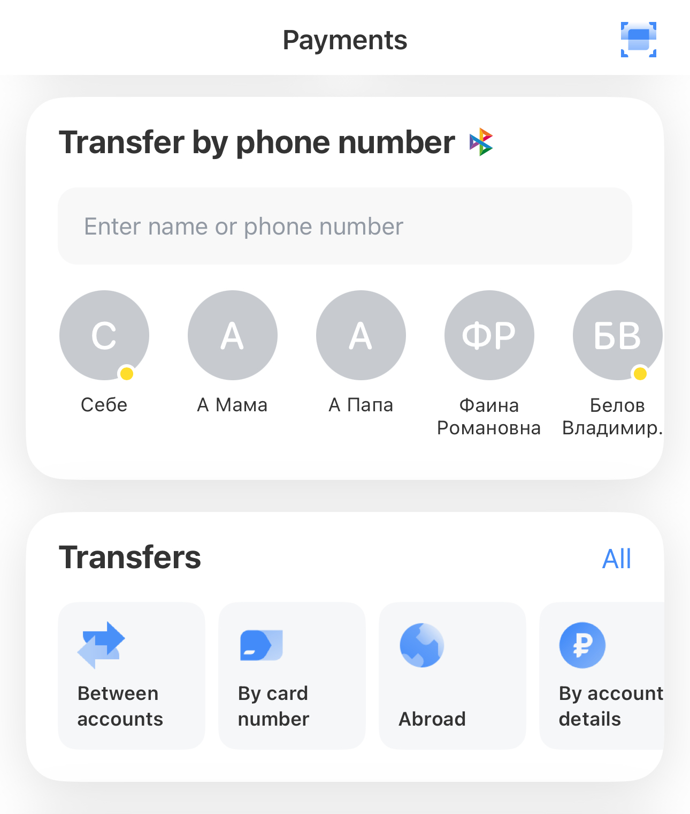
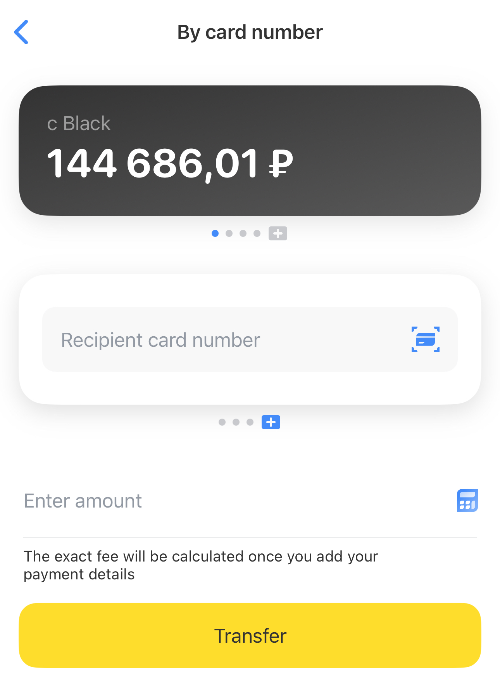
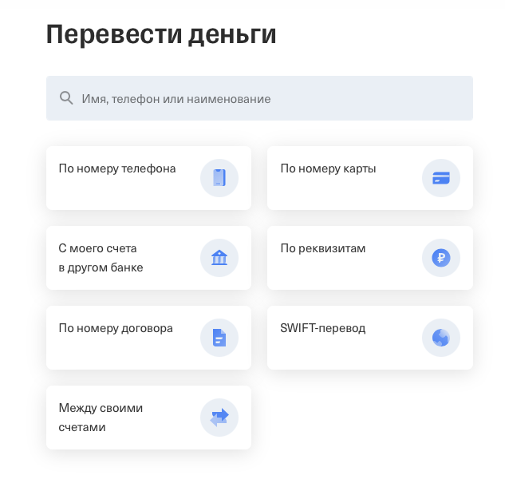
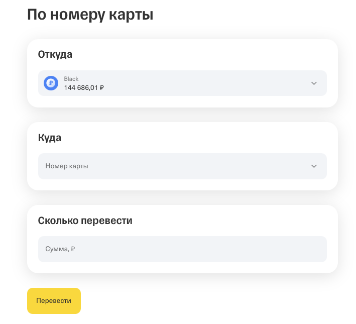

# Money transfer

Use the [T-Bank mobile app](https://www.tbank.ru/apps/) or [online banking](https://www.tbank.ru) to transfer money by phone number, card number, or full bank account details.

## Transfer money in the T-Bank mobile app

To transfer money using the [T-Bank mobile app](https://www.tbank.ru/apps/), follow these steps:

1. Open the app and tap **Payments** on the home screen.

2. Choose your transfer method:
   - **By phone number**: Use the Fast Payment System for instant transfers.
   - **By card number**: Transfer to another bank card.
   - **By account details**: Use the recipient's full bank account details.

     

3. Provide the transfer details:
   - Select the T-Bank card to transfer from.
   - Enter the recipient's phone number, card number, or bank account details.
   - Enter the amount (in RUB).

4. Tap **Transfer** to send the money.

   

## Transfer money in online banking

To transfer money using online banking, follow these steps:

1. Go to [Transfers](https://www.tbank.ru/payments/transfers/) and select the transfer method:
   - **By phone number**: Use the Fast Payment System.
   - **By card number**: Transfer to another bank card.
   - **By account details**: Use the recipient's full bank account details.

     

2. Provide the transfer details:
   - Select the T-Bank card to transfer from.
   - Enter the recipient's phone number, card number, or bank account details.
   - Enter the amount (in RUB).

3. Click **Transfer** to send the money.

   

## Transfer processing times

Processing times depend on the destination bank and transfer method.

**Instant transfers**
- Between T-Bank accounts
- Via the Fast Payment System

Most transfers to other banks arrive within seconds, but they can take up to one business day depending on the recipient’s bank.

> Note: If your transfer doesn't arrive within the expected time frame, contact T-Bank support.

## Transfer limits

Different transfer methods have specific limits:

| Transfer method               | Daily limit  | Monthly limit     | Limit per transfer                                           |
| ----------------------------- | ------------ | ----------------- | ------------------------------------------------------------ |
| Within T-Bank                 | No limit     | No limit          | No limit                                                     |
| Phone number (to other banks) | 30 transfers | 30,000,000 RUB    | 1,000,000 RUB (or 30,000,000 RUB to your own linked account) |
| Card number (to other banks)  | No limit     | 5,000,000 RUB     | 1,000,000 RUB                                                |
| Full bank account details     | No limit     | 1,000,000,000 RUB | 1,000,000,000 RUB                                            |

Limits reset on the first day of each month.

## Transfer fees

**Fee-free transfers**
- T-Bank accounts
- Via the Fast Payment System
- Using full bank account details

For phone or card transfers outside the Fast Payment System, the first 20,000 RUB per month is free. After that, a 1.5% fee applies (minimum 30 RUB).

> Note: The recipient's bank may charge additional fees. Contact their support for details.
